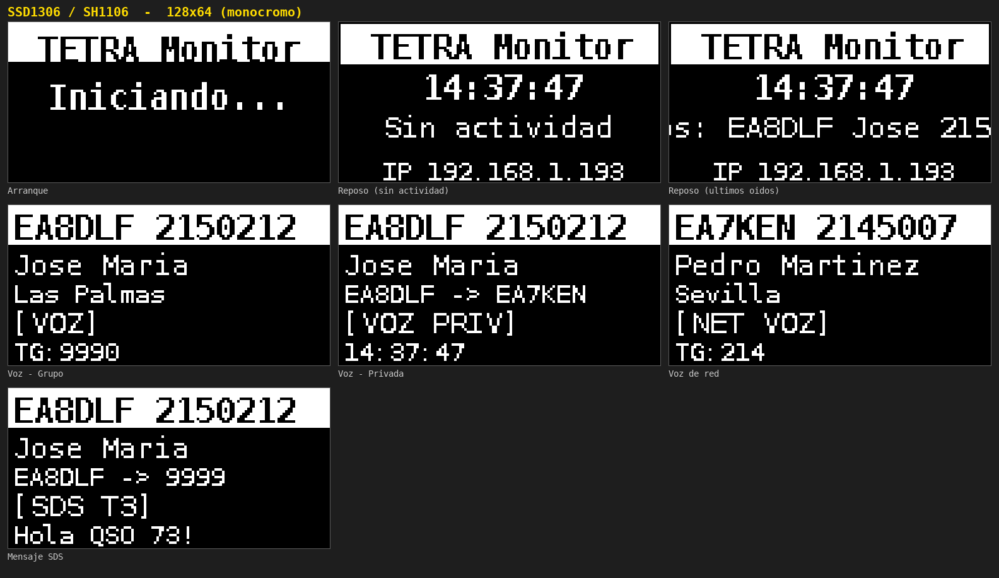
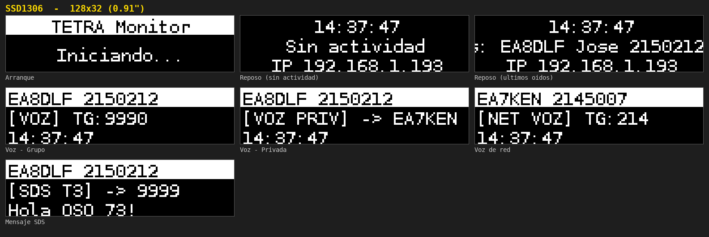
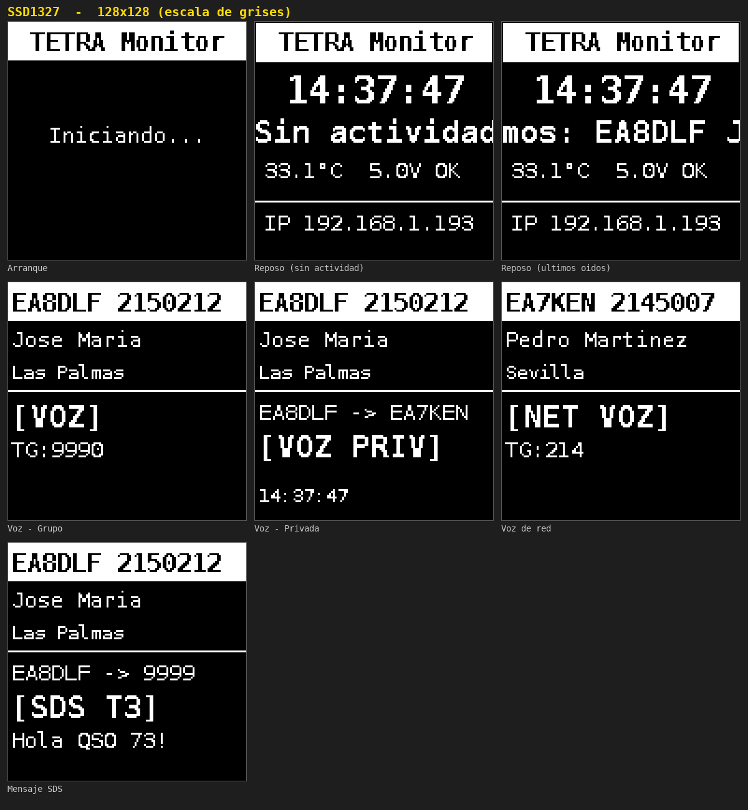

# TETRA OLED Display

[](https://github.com/EA8DLF/Tetra-oled-display/blob/main/LICENSE) [](https://github.com/EA8DLF/Tetra-oled-display/blob/main/CHANGELOG.md) [](https://www.raspberrypi.org/)

**Autor:** Jose Maria — EA8DLF  
**Compatible con:** [tetra-bluestation](https://github.com/MidnightBlueLabs/tetra-bluestation) (MidnightBlueLabs) · [FlowStation](https://github.com/razvanzeces/flowstation)

Sistema de visualización en tiempo real para redes TETRA sobre Raspberry Pi con pantalla OLED. Muestra quién transmite, indicativo, nombre, provincia, tipo de llamada y mensajes SDS — tanto locales como del resto de la red. En reposo enseña la hora y los últimos indicativos oídos desplazándose por la pantalla.

---

## Instalación rápida

```bash
bash <(curl -sSL https://raw.githubusercontent.com/EA8DLF/Tetra-oled-display/main/instalar.sh)
```

El script guía paso a paso: usuario, zona horaria, servicio de la estación, modo de datos, ISSI, pantalla (o detección automática) y giro. Guarda todo en `/etc/tetra-oled.conf`.

---

## Actualización

Si ya tienes el sistema instalado y quieres actualizar a la última versión sin perder tu configuración:

```bash
bash <(curl -sSL https://raw.githubusercontent.com/EA8DLF/Tetra-oled-display/main/actualizar.sh)
```

El script descarga y verifica la nueva versión **antes** de tocar nada, hace una copia de seguridad del script anterior y reinicia el servicio. Si vienes de una versión anterior a la 3.5.0, pasa automáticamente tu configuración del script a `/etc/tetra-oled.conf`.

---

## Requisitos

### Hardware

| Componente | Descripción |
| --- | --- |
| Raspberry Pi | Modelos 2B, 3, 4 o 5 con Raspberry Pi OS |
| Pantalla OLED I2C | Ver tabla de pantallas soportadas |
| Cables | 4 jumpers hembra-hembra |

### Pantallas soportadas

| Controlador | Tamaños | Librería |
| --- | --- | --- |
| SSD1306 (y SSD1309 / SSD1315) | 0.96" 128×64 · 0.91" 128×32 | Adafruit |
| SH1106 | 1.3" 128×64 | luma.oled |
| SH1107 | 1.5" 128×128 | luma.oled |
| SSD1327 | 1.5" 128×128 escala de grises | luma.oled |

Con `display_type = AUTO` el script busca la pantalla en 0x3C y 0x3D y lee su registro de estado para saber el modelo (SSD1306, SH1106 o SH1107). Si no lo reconoce usa SSD1306 y lo indica en el log; en ese caso fija el modelo a mano.

### Software

| Requisito | Descripción |
| --- | --- |
| tetra-bluestation o FlowStation | Ejecutándose como servicio systemd |
| TetraPack Monitor | **Opcional** — si no lo tienes, usa modo `journalctl` |

---

## Cableado

| Pin pantalla | Pin Raspberry | Descripción |
| --- | --- | --- |
| VCC | Pin 1 (3.3V) | Alimentación |
| GND | Pin 9 (cualquier GND) | Masa |
| SDA | Pin 3 (GPIO2) | Datos I2C — obligatorio |
| SCL | Pin 5 (GPIO3) | Reloj I2C — obligatorio |

> El cableado es idéntico en todos los modelos de Raspberry Pi con conector GPIO de 40 pines.
> Si la pantalla no enciende, prueba con Pin 2 (5V) en lugar de Pin 1 (3.3V) — algunos módulos baratos lo requieren.

---

## Modos de funcionamiento

### Modo `journalctl` (sin dashboard)

Lee los logs directamente desde el servicio systemd. **No requiere ningún dashboard adicional.** Solo lee lo nuevo desde que arranca (no repite eventos antiguos).

```ini
data_mode    = journalctl
service_name = flowstation.service   # ← el nombre de tu servicio
```

El usuario del servicio necesita permiso para leer el journal (grupo `systemd-journal` o `adm`); el instalador lo añade si hace falta.

### Modo `monitor` (TetraPack Monitor)

Lee los logs a través del dashboard web de TetraPack Monitor. Requiere tenerlo instalado y corriendo en el puerto 5000.

```ini
data_mode   = monitor
monitor_url = http://localhost:5000
```

---

## Configuración

Toda la configuración está en **`/etc/tetra-oled.conf`** (las actualizaciones no la tocan):

```bash
sudo nano /etc/tetra-oled.conf
sudo systemctl restart tetra-oled     # para aplicar los cambios
```

```ini
[oled]
service_name = flowstation.service   # servicio systemd de la estación
data_mode = journalctl               # journalctl o monitor
monitor_url = http://localhost:5000  # solo en modo monitor
local_issi = 2150212                 # tu radio: su TG tiene prioridad (0 = ninguno)

display_type = AUTO                  # AUTO, SSD1306, SH1106, SH1107, SSD1327
display_addr = 0                     # 0 = buscar en 0x3C y 0x3D
i2c_bus = 1
display_width = 0                    # 0 = tamaño habitual del modelo (p.ej. 128 y 32 para la 0.91")
display_height = 0
display_rotate = 0                   # 0, 90, 180 o 270

idle_mode = scroll                   # scroll = reloj + últimos oídos · clock = solo reloj
title = TETRA Monitor
brightness = 255                     # brillo con actividad (0-255)
idle_brightness = 50                 # brillo en reposo (0-255)

display_timeout = 30                 # llamada sin actividad → reposo (s)
call_min_display = 5                 # mínimo en pantalla para llamadas cortas (s)
sds_display = 5                      # SDS en pantalla (s)
screen_off_timeout = 0               # apagar tras este reposo (s); 0 = nunca

radioid = yes                        # descargar indicativos y nombres de radioid.net
```

> Si el archivo no existe, se usan los valores escritos al principio de `tetra_oled.py`.

### Adaptar al nombre de tu servicio

Comprueba el nombre de tu servicio con:

```bash
systemctl list-units --type=service | grep -iE "tetra|bluestation|flowstation|tmo"
```

---

## Pantallas

### Vista previa por modelo

Renderizado real de las pantallas (generado con [`Docs/preview/preview.py`](Docs/preview/), sin hardware):

**SSD1306 / SH1106 — 128×64**



**SSD1306 — 0.91" 128×32**



**SH1107 / SSD1327 — 1.5" 128×128** (mismo diseño; SSD1327 en escala de grises)



> Para regenerarlas: `pip install pillow && python Docs/preview/preview.py`

### Reposo

```
┌─────────────────────┐
│   TETRA Monitor     │  ← título (se mueve suavemente contra el quemado)
│      01:30:00       │  ← hora local del sistema
│ Últimos: EA8DLF Jo… │  ← últimos oídos desplazándose (indicativo, nombre, ISSI, TG, hora)
│ 33.1°C  5.0V OK     │  ← alterna temperatura/voltaje e IP
└─────────────────────┘
```

Con `idle_mode = clock` se muestra el reposo clásico (hora, temperatura, voltaje e IP). La pantalla **no se apaga** salvo que pongas `screen_off_timeout`; el brillo baja en reposo.

### Llamada de voz — Grupo

```
┌─────────────────────┐
│ EA8DLF 2150212      │  ← indicativo + ID DMR
│ Jose Maria          │  ← nombre completo
│ Las Palmas          │  ← provincia / población
│ [VOZ]               │  ← tipo de llamada
│ TG:9990             │  ← TalkGroup
└─────────────────────┘
```

La llamada se mantiene en pantalla mientras sigue activa, aunque dure más de `display_timeout`.

### Llamada de voz — Privada

```
┌─────────────────────┐
│ EA8DLF 2150212      │
│ Jose Maria          │
│ EA8DLF -> EA7KEN    │  ← origen y destino
│ [VOZ PRIV]          │
│ 01:30:00            │
└─────────────────────┘
```

### Llamada de red (otro usuario)

```
┌─────────────────────┐
│ EA7KEN 2145007      │
│ Pedro Martinez      │
│ Sevilla             │
│ [NET VOZ]           │
│ TG:214              │
└─────────────────────┘
```

### Mensaje SDS

```
┌─────────────────────┐
│ EA8DLF 2150212      │
│ Jose Maria          │
│ EA8DLF -> 9999      │
│ [SDS T3]            │
│ Hola QSO 73!        │  ← texto, cuando el log de la estación lo incluye
└─────────────────────┘
```

> FlowStation no escribe el texto de las SDS en su log, así que con FlowStation se ve el origen, el destino y el tipo, pero no el texto.

Si un ISSI no está en radioid.net, la cabecera muestra `ISSI 2150212`.

### Estados especiales

| Pantalla | Cuándo aparece |
| --- | --- |
| `Iniciando...` | Al arrancar o reiniciar el servicio |
| `Reiniciando...` | Al ejecutar `sudo reboot` |
| `Apagando...` | Al ejecutar `sudo shutdown` |
| `Detenido` | Al parar el servicio (`systemctl stop tetra-oled`) |

---

## Características

- ✅ Llamadas de voz locales (grupo y privada)
- ✅ Llamadas de red en tiempo real (otros usuarios en la red)
- ✅ Mensajes SDS locales y de red
- ✅ Prioridad inteligente de TG (no reemplaza el TG seleccionado)
- ✅ Indicativos y nombres desde [radioid.net](https://radioid.net) (actualización automática diaria)
- ✅ Reposo con los últimos oídos desplazándose; la pantalla no se apaga
- ✅ Detección automática del modelo y la dirección de la pantalla
- ✅ SSD1306 (128×64 y 128×32), SH1106, SH1107 y SSD1327, con giro de 0/90/180/270°
- ✅ Temperatura, aviso de subtensión e IP en reposo
- ✅ Anti-quemado: pixel shift suave y brillo reducido en reposo
- ✅ Sin parpadeo en cambios de slot/speaker (timer cancelable)
- ✅ Configuración en `/etc/tetra-oled.conf`, conservada al actualizar
- ✅ Arranque automático con systemd y reconexión automática al stream
- ✅ Compatible con cualquier usuario del sistema (no solo `pi`)
- ✅ Compatible con y sin TetraPack Monitor
- ✅ No consulta servicios externos salvo la base de datos de radioid.net (desactivable)

---

## Gestión del servicio

```bash
sudo systemctl start tetra-oled      # iniciar
sudo systemctl stop tetra-oled       # parar
sudo systemctl restart tetra-oled    # reiniciar tras cambios
sudo systemctl status tetra-oled     # estado
sudo journalctl -u tetra-oled -f     # logs en tiempo real
```

---

## Solución de problemas

**La pantalla no enciende**
- Comprueba el cableado: VCC→Pin1, GND→cualquier GND, SDA→Pin3, SCL→Pin5
- Ejecuta `i2cdetect -y 1` → debe aparecer `3c` (o `3d`)
- Activa I2C si no está: `sudo raspi-config` → Interface Options → I2C → Enable
- Si no aparece, prueba con Pin 2 (5V) en lugar de Pin 1 (3.3V)

**Se ve mal o desplazada**
- Mira en el log qué modelo se detectó: `sudo journalctl -u tetra-oled | grep oled`
- Si pone «sin identificar», fija `display_type` en `/etc/tetra-oled.conf` (una SH1106 manejada como SSD1306 se ve corrida 2 píxeles)
- Para las 0.91" pon `display_width = 128` y `display_height = 32`
- Si está al revés, usa `display_rotate = 180`

**El log dice `I2C device not found on address: 0x3C` (aunque `i2cdetect` sí ve `3c`)**
- Es un fallo de comunicación, típico de módulos SSD1327 baratos o cables de puente largos a 400 kHz. Baja el bus a 100 kHz y reinicia:
  ```bash
  sudo sed -i 's/dtparam=i2c_arm=on.*/dtparam=i2c_arm=on/' /boot/firmware/config.txt
  sudo reboot
  ```
  (En Raspberry Pi antiguas el archivo es `/boot/config.txt`.)
- Reasienta los 4 cables y usa cables cortos. Si sigue, prueba VCC en el Pin 2 (5V).

**El servicio no arranca**
- `sudo systemctl status tetra-oled` → ver el error
- Comprueba que el entorno virtual existe: `ls ~/oled-env/bin/python3`
- Activa el inicio automático: `sudo systemctl enable tetra-oled`

**No aparece ninguna llamada (modo journalctl)**
- Comprueba `service_name` en `/etc/tetra-oled.conf`
- El log de la pantalla dirá `journalctl terminó` si no tiene permiso: añade el usuario al grupo `systemd-journal` (`sudo usermod -aG systemd-journal pi`) y reinicia el servicio

**No aparecen indicativos**
- La BD de radioid.net se descarga al arrancar (puede tardar 1-2 min); si falla, se reintenta cada hora
- Comprueba acceso a Internet desde la Raspberry
- El indicativo debe estar registrado en [radioid.net](https://radioid.net)

**Sale «! VOLT»**
- La Raspberry tiene subtensión **ahora mismo** (fuente o cable insuficiente). Los avisos pasados ya no lo encienden.

**La hora es incorrecta**
- `timedatectl` → comprueba la zona horaria
- `sudo timedatectl set-timezone Atlantic/Canary` → corregir

**La pantalla está apagada**
- Solo se apaga si has puesto `screen_off_timeout` mayor que 0; se enciende sola al detectar tráfico
- Para encenderla: `sudo systemctl restart tetra-oled`

---

## Licencia

Este proyecto está bajo la licencia [MIT](https://github.com/EA8DLF/Tetra-oled-display/blob/main/LICENSE).  
Puedes usarlo, modificarlo y distribuirlo libremente citando al autor.

---

*Compatible con tetra-bluestation (MidnightBlueLabs) y FlowStation*
